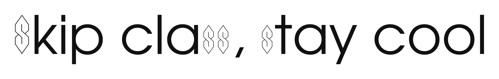

# S Tricky

**S Tricky** is a display typeface: [URW Gothic Book](https://github.com/twardoch/urw-core35-fonts)
with one modification. The
uppercase **S** (U+0053) and lowercase **s** (U+0073) are replaced by the
Super S. You know the one. Every other glyph is passed through from URW Gothic
Book unchanged.

The Super S is the original Cool S, scaled uniformly to two sizes: the cap **S** at cap height (1513) and the lowercase
**s** at x-height (1120), each on the baseline.




## Files

| File | Description |
|---|---|
| `STricky-Regular.ttf` | TrueType (desktop / general use) |
| `STricky-Regular.woff` | Web font, WOFF 1.0 |
| `STricky-Regular.woff2` | Web font, WOFF 2.0 (verified to round-trip back to the TTF) |
| `OFL.txt` | SIL Open Font License 1.1, full text |
| `README.md` | This file |

Family name **S Tricky**, style **Regular**.

## License

S Tricky is released under the **SIL Open Font License, Version 1.1**. See
[`OFL.txt`](./OFL.txt). It carries two copyright lines:

```
Copyright (c) 2026, Michael Seh (https://michaelsfonts.com), with Reserved Font Name "S Tricky".
Copyright (c) 2013, 2014, 2015 by (URW)++ Design & Development.
```

URW Gothic Book is offered by URW++ under the OFL 1.1 (among other licenses),
with no Reserved Font Name — so this derivative retains the original copyright
and license and reserves its own name.

**"S Tricky"** is a Reserved Font Name: use, study, modify, and redistribute
freely, but rename your fork — a modified version must not ship under the name
"S Tricky" or anything confusingly similar.

## Credits

- Base outlines: **URW Gothic Book**, © (URW)++ Design & Development, from
  [twardoch/urw-core35-fonts](https://github.com/twardoch/urw-core35-fonts).
- Super S substitution and packaging: Michael Seh, https://michaelsfonts.com.
- The Super S is a folk symbol with no known single author. Although it may
  well have been my friend Mattias, who first showed it to me and is, as far as
  I'm concerned, the creator.
